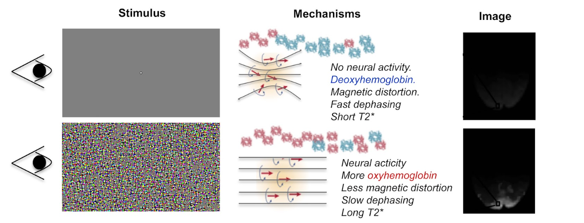
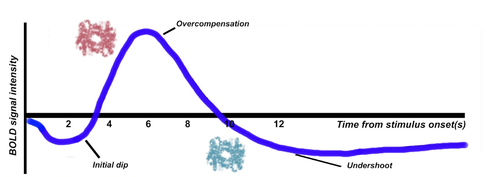
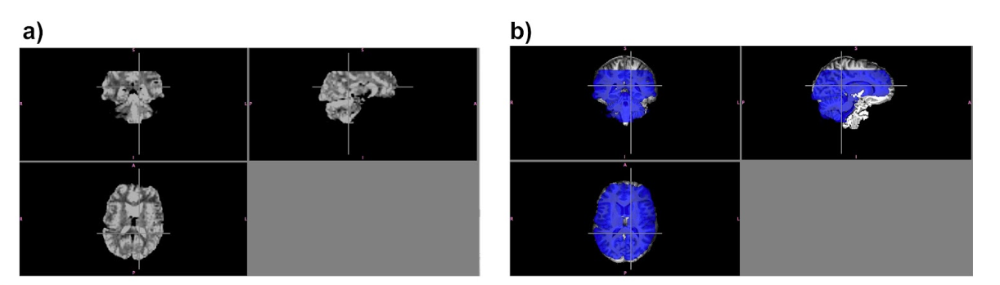
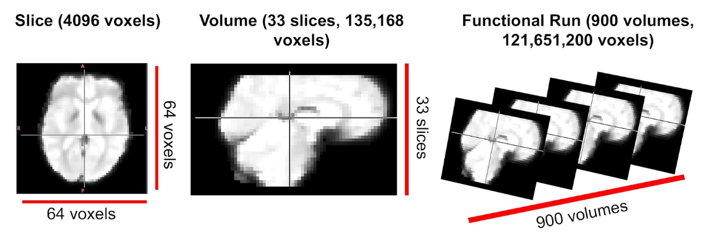
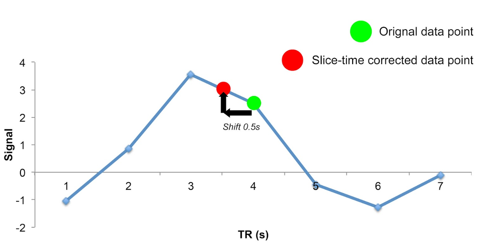
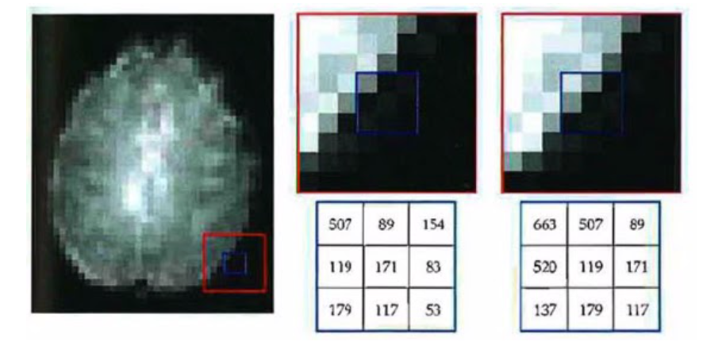
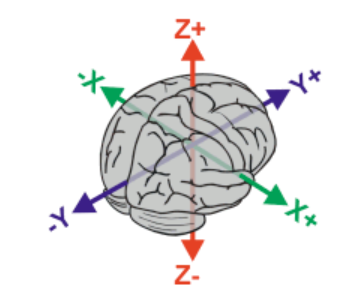
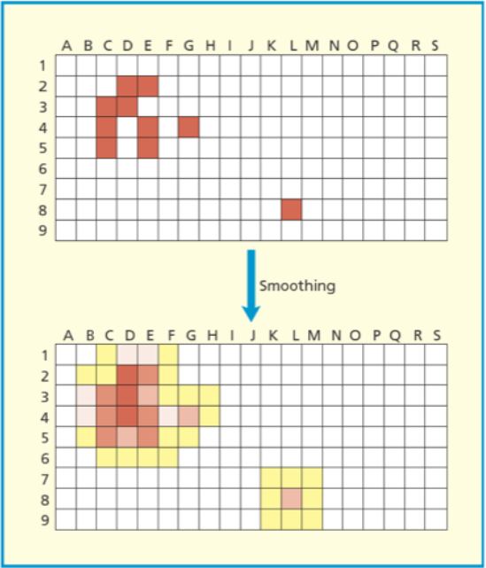
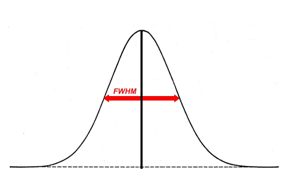

.. _guide-for-newbs.rst:

==============================================
Beginner's Guide to fMRI Preprocessing
==============================================
| Contributors: Nathan TM Huneke, Nick Hedger
| Maintainers: Nathan TM Huneke

---------------------------------------------

Functional neuroimaging aims to relate performance in some sort of task with neural activity in a region of the brain.

Logic of fMRI
---------------

The basic logic underlying functional MRI is as follows:
- Firstly, the brain consumes around 20% of our oxygen uptake. This is usually in response to neural activity, which uses up energy and therefore creates a need for oxygen.
- Hemoglobin is a molecule in the blood that can transport this oxygen.
- The magnetic properties of hemoglobin differ depending on whether or not it is carrying oxygen.
- De-oxygenated hemoglobin has what are called paramagnetic properties, which can cause distortions to the local magnetic fields induced by the scanner. This means that protons receive slightly different magnetic field strengths, which interferes with magnetic resonance. By contrast, oxygenated hemoglobin is more diamagnetic and less paramagnetic than de-oxygenated hemoglobin.
- When there is neural activity in a region, metabolic demands increase and so more oxygenated hemoglobin is rushed to the area. As a result, the presence of oxygenated hemoglobin reduces the signal distortions caused by de-oxygenated hemoglobin.

This forms the basis of the blood oxygen level dependent (BOLD) response. 
It is sensible to think of the BOLD response as being the ratio of oxygenated to deoxygenated hemoglobin, which is measured via these distortions to magnetic resonance.

Unlike structural images, where the relative signal intensity in an image depends on the T1 relaxation of the tissue, signal intensity in functional images represents a different, independent component of the MR signal: T2* relaxation. On the application of an RF pulse, 
the precessions of hydrogen protons are aligned in one direction (they are phase coherent), which produces a strong signal. However, immediately afterwards, 
this arrangement is lost and the precessions lose coherence. Spatially proximate spins may interact like bumper cars on a track, causing some spins to 
precess faster than others. This dephasing of precessions leads to an exponential decay in the MR signal that is described by the time constant T2. 
This dephasing can be partly explained by the contribution of paramagnetic artefacts that cause local magnetic field variations, and this contribution is described 
by the time constant T2*. Dephasing in a paramagnetic environment (near deoxygenated hemoglobin) is faster than dephasing in a diamagnetic environment 
(near oxygenated hemoglobin). Thus, pulse sequences sensitive to T2* relaxation show more signal intensity in locations where blood is highly oxygenated.

A Simple Experiment
~~~~~~~~~~~~~~~~~~~~

To clarify,  it is perhaps useful to think of things in terms of a simple experiment (see figure below). Suppose we are interested in recording from the visual cortex, 
which is at the posterior part of the brain. We want to contrast two conditions. In the rest condition (upper row), the observer views a blank screen and in the active condition 
(lower row), the observer views a salient visual stimulus.

In the rest condition, since there is no visual stimulation, there is little neural activity in the visual cortex and so there is a high concentration of deoxy-hemoglobin. 
As a result, the magnetic susceptibility of the nearby protons is distorted and proton dephasing is fast. 
This means that the visual cortex emits a weak T2* signal.

However, in the active condition, the participant views a salient stimulus, this means that there is an increase in neural activity in the visual cortex, and so oxyhemoglobin rushes to this region. 
As a result, there is a reduction in the paramagnetic distortions to magnetic resonance and therefore T2* increases. 
It's this increase in signal that is shown in the image on the right below.

    Upon visual stimulation there is an increase in local neural activity in the visual cortex. This results in oxygenated hemoglobin rushing to the area.
    As a result, the paramagnetic distortions to magnetic resonance are reduced and the T2* increases. This is reflected on the image on the right.

|

Hemodynamic Response Function
~~~~~~~~~~~~~~~~~~~~~~~~~~~~~~~~

When we record from a region of neural activity, the BOLD response resembles a hemodynamic response function (HRF). We can explain the shape of this function in 
terms of the concentration of oxygenated and de-oxygenated hemoglobin. 

    Firstly, there tends to be a initial dip in the function, which reflects the neurons consuming oxygen. 
    Therefore temporarily, the concentration of deoxygenated hemoglobin is higher. As a compensatory mechanism, the vascular system rushes more oxygenated hemoglobin 
    to the area, at a faster rate than it can be consumed, giving rise to local blood oxygen levels that are higher than necessary. 
    This results in an elevated response (an overcompensation) that typically peaks after around 6 seconds. The third component is an undershoot. 
    This probably reflects the vascular system tiring, before oxygen consumption returns to normal again, as a result there is temporarily more de-oxyhemoglobin again.

|

The shape of the HRF is not just worth learning about for purely theoretical reasons. It has a number of practical applications. Most notably, the canonical shape of the HRF is an important component 
of the statistical models that are used to analyze functional imaging data.

A Typical Scanning Session
----------------------------

This next section is designed to give you a more tangible idea of what happens during a typical scanning session. 
A typical scanning session consists of at least 3 separate scans. A *localiser scan*, a *high resolution structural scan* and a *functional scan*.

Localiser
~~~~~~~~~~~

Firstly, a  localizer scan is conducted. This consists of a 1-2 minute low resolution scan, that allows the radiographer to localize the brain for further scans. 
The basic idea of this scan is to allow the radiographer to determine where the brain is located in scanner coordinates and use these coordinates to guide further scans.

High Resolution Structural scan
~~~~~~~~~~~~~~~~~~~~~~~~~~~~~~~~

Next, a high resolution T1 structural scan is collected. Because this is a high resolution image, it takes a long time- usually 8-10 minutes. 
But why, you may ask, are we bothered with collecting a static, structural image for a functional imaging study?

The reason this structural scan is collected is because the functional data that follows is much lower resolution. 
We need this higher resolution scan so that we can register the functional data to an image that has more precise spatial co-ordinates.

By way of illustration, some functional data is plotted in the figure below (a). As you can see, this is very low resolution and it's hard to differentiate 
between structures. In fact, it's hard for us to even tell what part of the brain we are recording from. However, if we superimpose this on the high 
resolution structural scan (b), this all becomes a lot easier. We can see that we are recording from the posterior part of the brain, and we can better 
differentiate between parts of the subjects' anatomy.

    a) Shows low resolution functional data (74*74*36). b) Shows the same data (translucent blue) superimposed on a high resolution image (144*198*200). The functional 
    data has been upsampled and spatially registered to the same space as the high resolution structural data. This registration process improves the ability to make 
    inferences about regions of task-related activation.

|
Functional Scan
~~~~~~~~~~~~~~~~

Next, the functional scan itself is collected. This consists of a series of low-resolution scans, or *volumes* that are collected 
while a task is being performed by the participant. It is important to note that functional data are 4 dimensional. First there is the 3 dimensional image of the 
brain and the fourth dimension is the volume number in the time dimension. Its perhaps useful to think of functional data as being like a 3 dimensional video recording 
of the brain, with each volume being like a 'frame' of a video. Obviously, the length of a functional scan will vary depending on the complexity of 
the particular experimental design and related factors, but a typical functional scan will be around 30 minutes long and is usually broken into a series of 
discrete *functional runs* of approximately 10 minutes.

Functional Scan: Important Parameters
***************************************

There are two parameters of a functional scan that are important to understand. First is the *repetition time*, which is abbreviated to *TR*. This is the length 
of time between successive functional volumes. If the whole brain is scanned, a TR is usually 2-3 seconds. Secondly, there is the *size of the voxels* (resolution), or the 3 dimensional 
units of space that are recorded from. You can think of these in terms of the brain being broken down into as cubes (or more precisely - pyramidal shapes). 
From each voxel there is a corresponding data point. If the voxel size is large, we have a low resolution image, whereas if the voxel size is small the representation 
of space is more precise and the image has higher resolution.

There is an inherent trade off between these two parameters, for instance if we want small voxels, we then have to record more data points per volume 
and thus it takes longer to scan the whole brain. However, if we have large voxels, we only need to record a few data points and thus our TR can be shorter. 
In other words, we can sacrifice spatial resolution for temporal resolution and vice versa. Conceptually, this is the same trade off associated with cathode ray tube (CRT) 
monitors: low resolutions support higher refresh rates than higher resolutions.

Of course, not all functional scans require each volume to be a recording of the entire brain. It is perfectly viable to obtain *partial brain* functional volumes to decrease the 
TR and length of the experiment. In the functional data we saw :ref:`earlier <guide-for-newbs#id3>`, much of the parietal lobe 
was sacrificed so that better spatial resolution of the occipital and temporal lobes could be obtained. 

Functional Scan: Example
*************************

Let's think about some hypothetical functional data for a moment. The main point of this is to illustrate the 4 dimensional nature of the data and the vast amount 
of data handling involved with functional imaging experiments. 

As described above, a functional scan consists of a series of 3 dimensional volumes, each of which is composed of voxels. A typical voxel might be 
*3mm cubed* in size. To scan an entire human brain once, *33 separate slices* may be required, each containing a 64*64 grid of voxels. Per individual volume, 
we are therefore recording *135,168* data points. However, we don't just obtain one volume in a functional scan, we record very many successively. 
In a 30 minute functional scan with a TR of 2 seconds, each of these 135,168 data points would need to be recorded *900* separate times. 
This gives us a total of *121,651,200 data points*. Thus, even making fairly standard assumptions about parameters, the amount of data involved in functional 
imaging is somewhat intimidating.

    A functional run is composed of successive volumes, each of which contains slices. It is intuitive to think of functional data like a 3D video recording 
    of the brain.

|
Other Scans: Shimming and Field Map 
~~~~~~~~~~~~~~~~~~~~~~~~~~~~~~~~~~~~

Under optimal conditions, a scanner would have an entirely uniform magnetic field. Even if this were possible, we unfortunately have to place humans inside of 
the scanner, which distorts the magnetic field. Two scans are occasionally conducted to characterise and partially correct for this distortion. 
After the participant enters the scanner, all inhomogeneities can be corrected via a process known as *shimming*. Often however, these distortions 
will eventually reappear and it is impractical and time consuming to keep repeating this process. As a result, a *field map scan* is often collected to 
characterise the inhomogeneity in the magnetic field, so that it can later be corrected in data preprocessing.

Preprocessing Steps 
---------------------

As described above, the canonical shape of the hemodynamic response function (HRF) is important for the statistical models used to analyze fMRI data. However, as a 
result of the way functional MRI scans are acquired, a number of issues can interfere with the normal shape of the HRF. The data therefore need to be *preprocessed* to 
attempt to approximately 're-create' the HRF before statistical models can be run.

The following steps below are discussed in no particular order and to help with understanding.

1. Slicetiming Correction
~~~~~~~~~~~~~~~~~~~~~~~~~~

Problem 
********

A standard echo planar imaging (EPI) sequence for fMRI data acquisition involves functional volumes being collected in successive 2D slices. For instance, 
assuming a repetition time (TR) of 1 second and 35 slices being collected in ascending order, this entails that the top slice is collected approximately 0.97 
seconds after the bottom slice. Clearly this presents a problem, since we want all data points in our volume to correspond to the same point in time (the 
timing of a *'reference' slice*).

Solution
*********
Fortunately, the solution to this problem is relatively straightforward. Conceptually, all slice timing algorithms operate in the same way: 
There is some form of *interpolation* between the data points we did acquire, to allow prediction of the data points we *would have* acquired if the data from all 
slices were collected at the same time.

For instance, let's suppose that the figure below shows the response (blue points) recorded from a voxel in the top slice in successive volumes (TR = 1s). 
Let's also suppose that our slices were acquired in an ascending order (from bottom to top). For this data in the top slice to correspond to the timing of the 
middle slice (our *reference slice*, in this example) we simply interpolate between the data points (blue line), navigate ~ 0.5 seconds back along the 
x axis and use the interpolation line to give us the response corresponding to the acquisition of the middle slice. Then, we simply repeat this process of 
interpolation for all slices to give us our completed set of slice-time corrected data.

|

The slice acquisition order can be found in the ``JSON sidecar`` associated with the functional run in a ``BIDS`` compliant dataset.

2. Motion Correction
~~~~~~~~~~~~~~~~~~~~~~

Problem
********

If a subject moves their head during an fMRI experiment (they will), their head will move to different locations within the scanner. 
This can mean that the same voxel records from a different region of the brain on successive volumes (below). Clearly, we don't want this - 
even small movements can badly corrupt fMRI data - we want the same voxel to be recording from the same location in the brain throughout the functional run.

|

Solution
*********

The solution to correcting for head movement is quite intuitive. All corrections for motion essentially use modifications of the same algorithm, which involves 
the minimization of a *least-squares cost function*, or maximization of *mutual information*. The algorithms attempt to find the movements to apply to each volume that 
minimize the voxel-by-voxel intensity difference from a reference volume (usually the middle volume in the functional run).

Since the head does not change shape or size, it can be treated as a *rigid body*. Any rigid body movement can be described by 6 parameters. 1) A *translation* along the 
x axis, 2) a *translation* along the y axis, 3) a *translation* along the z axis 4) a *rotation* about the x axis, 5) a *rotation* about the y axis, 6) a *rotation* about 
the z axis. 

|

Thus, motion correction algorithms perform these rigid body movements until a set of parameters are obtained that ensure each volume agrees as closely as possible with a 
reference volume (e.g. the middle volume) at each x y and z coordinate. Since it is not viable to characterise all possible ways in which the head could move during a 
functional run, motion correction is an *iterative* process - an initial rough estimation followed by more precise refinements. Once an optimal set of realignment 
parameters has been determined, the original data is then resampled to estimate the values that would have been obtained if there had been no head motion. Similar to 
slice-timing correction this involves interpolation - but in the spatial domain rather than the temporal domain. Unlike temporal interpolation, which only involves 
1 dimension, this spatial interpolation involves 3 dimensions. *Tri-linear interpolation* assumes that each interpolated data point should be a weighted average of 
all adjacent data points.  

FAQ's
******

**Can motion correction algorithms tolerate very large head movements?**

An exact answer is not straightforward, but standard motion correction algorithms can tolerate misalignments that do not exceed 10mm (summed in the x,y and z directions). 
One beneficial strategy is to examine the plot of the estimated motion parameters for a functional run and determine which volumes are misaligned by more than the size of a 
voxel. These volumes can then be defined as 'outliers' and excluded from the analysis (known as *scrubbing*). This may, depending on your experimental design, 
fundamentally distort your trial balancing and compromise your parameter estimates. If this is the case, you should be prepared to exclude subjects data altogether. 
Head movement is something to be taken very seriously and you should make every effort to ensure subjects do not move their head during data acquisition in the first place. 

3. Brain extraction
~~~~~~~~~~~~~~~~~~~~~

Problem
*********

Due to the non-invasive nature of the imaging, a considerable amount of non-brain tissue is included in magnetic resonance images. This includes eyeballs, 
skull tissue, muscle and so on. Removing this redundant tissue can significantly reduce file size and aid the algorithms involved in registration and normalisation, 
almost all of which assume that non-brain tissue has been removed.

Solution
*********

Manual brain tissue segmentation is possible, although it can be incredibly time consuming and requires a large degree of training. A popular automated solution 
(`Brain Extraction Tool <https://fsl.fmrib.ox.ac.uk/fsl/fslwiki/BET/UserGuide>`_, implemented in FSL) is based on the following logic. Recall that in a standard T1-weighted image, differences in the water content between 
tissue are represented as differences in intensity (e.g. white matter = light, cerebrospinal fluid = dark). These regularities can therefore be exploited to segment 
brain from non-brain tissue based on local differences in image intensity.  First, the intensity histogram of the image is obtained, from which 'robust' minimum and maximum 
values are determined (i.e. the 2nd and 98th percentile of intensity values). Next, an intensity threshold is determined to distinguish between the brain and background, 
determined by 10% of the way between the 2nd and 98th percentile. This threshold is then used to estimate the centre of the brain tissue. A small tessellated icosahedron (3D shape with 20 sides) is 
then initialised as a surface model at the brain centre estimate and a set of adaptive forces (described by Smith, 2002) iteratively modulate and deform each vertex 
so that the brain model moves outward until it reaches the brain surface, as defined by the intensity threshold. 

4. B0 distortion correction
~~~~~~~~~~~~~~~~~~~~~~~~~~~~

5. Registration and Normalisation
~~~~~~~~~~~~~~~~~~~~~~~~~~~~~~~~~~

Problems
*********

1. **Registration**.  A first problem that we are presented with is that functional data is very low resolution compared to our structural data. As compared to structural data, functional data can appear something of an indistinct blob, particularly after spatial smoothing. From functional data alone, it may be difficult to tell whether task related activation is located in one brain region, or an adjacent brain region. 
2. **Normalisation**. How can we determine common regions of neural activation between subjects? Moreover, how can we report the loci of neural activation in a standardised format? These tasks would be trivial if all human brains had identical size and structure. However, unfortunately, human brains vary massively in shape and size and these differences are present in virtually every region of the brain. These drastic anatomical differences make it impossible to know whether clusters of activation are in equivalent brain regions in every subject. 

Solutions
**********

Registration
=============

We can register our functional data to our high-resolution structural data to improve spatial localisation of task-related activation. Intuitively, it may seem as 
though this could be achieved via a similar method to that employed in motion correction. The critical differences though, are that 

1. The resolutions of the structural and functional images are different 
2. The structural and functional volumes are run with different imaging parameters and their contrasts are different (namely T1 and T2* contrasts). 

The most common current solution to this problem is as follows. A first step is to create an intensity histogram of each image. Next, the intensity value of each 
voxel is replaced with the bin number to which that intensity value was assigned in each histogram - thereby associating each voxel with two bin numbers - one from each 
image. Finally, a series of linear transformations are conducted on the functional volume until the association between the histogram bins of the voxels is maximised. 
The method works because if the images are aligned, you would observe such an association regardless of the contrasts of the images, or their resolutions. 

Normalisation
==============

We need to apply non-linear transformations to alter the shapes of our subjects brains, so they are the same size and shape as a *standard brain*, such as the MNI brain. 
The concept of normalisation may be familiar to anyone that has watched a video of 'morphing' software that can transform one person's face into another. 
Normalisation is considerably more complex than registration. This is because registration can be achieved by simple linear transformations. By contrast, a number of 
nonlinear transformations are required to alter the shape of a subjects brain to match a standard brain. Although there are many different normalisation algorithms, 
they usually begin with an initial linear transformation that aligns a subject's brain to a standard as closely as possible (essentially, this is achieved by the 
same process detailed in the :ref:`<guide-for-newbs/5. Registration and Normalisation/Solutions/Registration>` section). Then, the differences that remain between 
the two images are reduced by local stretching, shrinking and warping. 

For instance, suppose that a subject had a particularly large visual cortex and a particularly small cerebellum. To normalise, we would need to shrink the 
visual cortex and stretch the cerebellum. This kind of operation is simply not possible with a linear transformation. Since normalisation methods perform a number of 
transformations in each small brain region, the algorithms often have millions of parameters. 

FAQ's
******

**What if my subject's brain is non-normal?**

Many interesting fMRI experiments are conducted on children, or special adult populations. There is a large amount of literature available on 
conducting normalisation on lesioned brains (Brett et al, 2001), or child brains (Wilke et al., 2003) that you can consult.

**How do I check normalisation?**

Pipelines like fMRIPrep will provide reports that you can check. Manual checking involves careful inspection in FSLeyes or similar application. 
Overlay the normalised image on top of the MNI 152 template. It is useful to check that 'landmark' anatomical features (e.g. the cerebellum, corpus collosum, 
grey and white matter boundaries) are closely overlapping. It is also informative to compare the normalised data and un-normalised data in terms of their 
similarity to the standard. This way, you can make more effective decisions about the appropriateness of the local warping that has occurred. 

**What if I want to register a partial-brain functional volume?**

This shouldn't pose too much of a problem. One can employ *Boundary Based Registration (BBR)* for registration of the functional volume to the structural data 
(Grieve et al, 2009). This method first depends on segmenting white and grey matter from the structural image. Next, the white matter is linearly registered to the 
functional volume using the histogram-based method we discussed before. Samples of the intensity of the functional volume are then taken from either side of the white 
matter boundary. The difference in these intensities is then used to create a function that is maximised by further transformations. In other words, this method exploits 
the reliable intensity differences between white and grey matter found in EPI images to guide registration. This method has been found to achieve excellent results for 
the registration of partial brain volumes. This method is used by default in fMRIPrep.

6. Spatial Smoothing
~~~~~~~~~~~~~~~~~~~~~~

Problem
********

Functional MRI data are noisy. This is partly due to factors that can be corrected to a large extent (e.g. head movement, magnetic inhomogeneities) and partly due to 
factors that cannot even be measured (thermal noise, system noise). One obvious negative consequence of this substantial noise is a decreased signal to noise ratio, 
which means that task-related effects can be hard to detect. 

Solution
*********

Smoothing is based on the following assumptions:
- Firstly, there is a good chance that task-related activity in an isolated voxel reflects noise, and that task-related activity in a group of voxels reflects a genuine signal.
- Secondly, spatial noise is mostly Gaussian - mostly random, independent from voxel to voxel and has a mean of zero. Therefore, the average of noise is zero and the average of signal is non-zero.

By smoothing the data, we essentially spread the raw activation of a given voxel onto neighbouring voxels, using a Gaussian smoothing kernel. This has the effect of 
penalising the influence of what is probably noise, whilst increasing the influence of what is probably signal - in other words, it reduces the *false-positive rate*. 
By way of illustration, in the figure below (upper panel) there are two regions of activation. Since most task-related neural activity tends to take place 
in clusters rather than isolated voxels (though see caveats below), there is a good chance that the left region reflects signal and the right region reflects noise. 
Lets consider voxel D4 in the left region. Prior to smoothing it was inactive, but has become 'active' as a result of smoothing due to the spreading of activation from 
its neighbours. In contrast, voxel L8 was initially highly active, but its activity has been reduced since it has inactive neighbours. Thus, the influence of signal has 
been increased and the influence of noise has been diminished. 

|

As well as enhancing the signal to noise ratio, smoothing increases the spatial extent of active regions. This increases the chances of finding common regions 
of activation when averaging across subjects.

FAQ's
*******

**Under what circumstances should I smooth data?**

Compared to other pre-processing stages, smoothing is relatively controversial (for this reason, smoothing is not included in fMRIPrep) and the FAQ's are 
associated with less precise answers. There are many circumstances where smoothing would be highly inappropriate. Smoothing is essentially 'blurring' the data 
and so if we are concerned with voxel by voxel resolution (for instance, in retinotopic mapping, or in multivoxel pattern analysis) we wouldn't want to 
smooth the data. Moreover, if you have reason to believe that your activations of interest will only extend a little more than 1 voxel, then smoothing would also 
be inappropriate. It is also the case that the supposed benefit of increasing the spatial extent of active regions may not be desirable in cases where individual 
differences are the focus of the study. In such cases, you could justifiably not smooth the data.    

**How do you decide on the size of your smoothing kernel?**

In fMRI analysis, the size of a Gaussian smoothing kernel is defined in terms of its *full width at half maximum (FWHM)* - as illustrated below. We know from 
matched filter theorem that we can best recover a signal from noisy data by employing a filter the same size and shape as the signal. In the context of fMRI, 
this would entail using a Gaussian kernel that is as close as possible in size to the region of activation. The problem is that, in most cases, we can only make vague 
assumptions about the size of active regions prior to an experiment. Even if we suspect a particular structure will be active (e.g. the amygdala) we may only 
obtain activity in a sub-region of the structure, not the whole structure. 

|

We can at least apply a heuristic in deciding the size of a kernel. A kernel that is larger than the signal will be associated with more negative consequences 
than a kernel that is smaller than the signal. An oversized kernel will result in regions that contain noise being 'averaged in', thereby reducing the signal. 
Additionally, it is possible that two distinct signals can be fused together if a kernel is oversized. Skurdlaski et al (1999) have determined that a kernel of 
1-2 voxels worked best overall in the presence of unknown activation sizes. 

7. Temporal Filtering
~~~~~~~~~~~~~~~~~~~~~~

Problem
********

Functional MRI data is characterised by noise in the temporal dimension. This noise is mostly concentrated in the low frequency range . 
Likely causes of these low frequency components are fluctuations in the magnetic field properties of the scanner (known as scanner drift), or generic changes in basal metabolism. 
In event-related designs, these changes are generally too slow to correspond to task-related neural activation and can distort the signal we are interested in 
(which tends to be much higher frequency).

Solution
*********

The most common solution to removing these low-frequency components is to apply a *high-pass temporal filter*. This results in low-frequency components being 
removed from the data and only the relevant, higher frequency components of the signal being preserved. However, this is controversial and would be inappropriate in certain 
designs. For example, in resting-state scans, the low-frequency components are *of interest* and so removing these will remove the signal we are interested in. For these reasons, 
temporal filtering is not applied in fMRIPrep.

FAQ's
******

**How do I determine a cut-off for a high pass filter?**

This has no simple answer, but the application of the filter should ensure that task-related activation is not altered by the filtering process. The goal is to 
filter out as much low frequency noise as possible without altering anything corresponding to the 'fundamental frequency' of your experimental design. For instance, 
a typical hemodynamic response function (HRF) in response to a 500ms visual stimulus rises to a peak after about 6 seconds and decays back to baseline after around 
15 seconds. In practice, the default strategy of many software packages is to only filter our frequencies with a period of ~ 120 seconds or longer, which will generally 
not alter signals relating to this HRF in an event related design. By contrast, in blocked designs, we may alternate between viewing one visual stimulus for 2 minutes 
and viewing a blank screen for 2 minutes, meaning that we can expect periodic changes in task-related activation that repeat every 240 seconds. In this case, the 
120 second high pass filter would eliminate much of the signal that we would want to detect. Therefore, a common strategy is to apply the cut off at 
*twice the period at which the task related activation is expected to repeat*. Applying this rule will produce a cut off period of 480 seconds for this blocked design. 

**What about low pass filtering?**

Low pass filtering is much more controversial than high pass filtering. The essence of the problem is that noise is not independent from volume to volume in fMRI and 
so smoothing the data in the temporal dimension can actually enhance the noise relative to the signal. Given i) mounting evidence that low pass filtering is 
counterproductive (Della Maggiore et al, 2002) and  ii) the fact that low pass filtering is no longer a pre-processing option for many dominant software packages 
(SPM, AFNI, Brainvoyager) we will not discuss it any further.