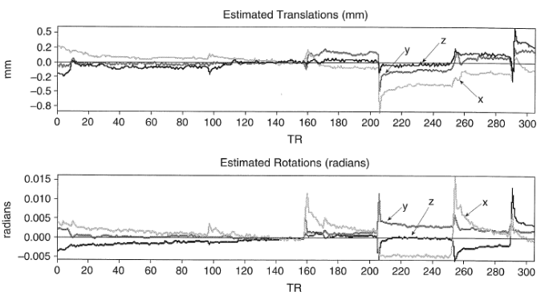

.. _running-feat.rst:

==============================================
fMRI Analysis with FEAT
==============================================
| Contributors: Yukai Zou
| Maintainers: Nathan TM Huneke

--------------------------------------------

.. note::
    Under construction

FEAT
----

Launch FSL FEAT GUI
*******************

In the terminal, type ``fsl &`` to launch FSL, and click on the "FEAT FMRI Analysis" icon to launch the FEAT GUI.

.. tip:: Navigating to the data folder first

    It is recommended that the command is called after navigating to the directory where the data is located, so that loading the image data will be easier.

.. tip:: Avoiding spaces in file and folder names

    Avoiding having spaces in the file and folder names. This is considered a good practice in general when operating in Unix/Linux environment. Consider replacing spaces with underscores or dashes.

(Optional) Load FEAT Configuration
**********************************

If you have a FEAT configuration file (``.fsf``) from a previous analysis, you can load it by clicking on the **Load** button. This will import all the settings from the configuration file, and you'll be able to modify from there.

Slice timing correction
***********************

Click on the "Pre-stats" tab, and select "Slice timing correction" from the drop-down menu. Choose "Use slice timings file", and select the file that corresponds to the input data. The file should be a text file with one number per line, corresponding to the slice acquisition order. 

.. important:: Check whether your DICOM data contains slice timing information

    It is important to check with radiographer whether the DICOM data contains slice timing information. Data collected UHS MRI scanners undergo anonymisation process, which can remove slice timing information before the data is transferred to the user. Typically, slice timing information can be preserved when the DICOM images are burnt onto a DVD from the scanners.

Head motion correction
**********************

Under "Pre-stats" tab, select "MCFLIRT" from the drop-down menu of motion correction. This will enable motion correction.

.. note:: Motion correction is not always necessary

    While head motion correction is critical, it is not always a mandatory preprocessing step. For instance, motion correction is not accurate on edge slices, where the cerebrospinal fluid (CSF) flows in and out of the imaging volume. Performing motion correction in this case can actually lead to inaccurate voxel's slice position. See `Fultz et al. 2019 <https://pubmed.ncbi.nlm.nih.gov/31672896/>`_ for details. 

Coregistration
***************

Click on the "Registration" tab, and under "Main structural image", select the individual's T1-weighted brain image.

.. tip:: Perform brain extraction on the T1-weighted image beforehand

    Registration may be affected by large field of view (FOV) of the T1-weighted image and the skull. Therefore, performing brain extraction on the T1-weighted image beforehand can improve the registration accuracy. Even though BET brain extraction can be enabled in FEAT, it's good idea to provide a brain-extracted T1-weighted image directly if possible.

Normalisation
*************

You'll need to choose brain atlas for this step. In FSL there are a range of standard brain atlases available, in which we will be using the MNI152 T1 2mm atlas (``MNI152_T1_2mm_brain.nii.gz``). This is a commonly used standard brain in neuroimaging research.

.. tip:: How to find the path of FSL installation

    In a terminal, type ``whereis fsl``. This will return the path of the FSL installation.

Run FEAT
********

You are now ready to run FEAT. Press **Go** to start the analysis. FEAT should normally take a few minutes to complete. 

Viewing FEAT Analyses Results
-----------------------------

In a file browser (e.g. Windows File Explorer), navigate to the output folder of the FEAT analysis. This folder should end with the suffix ``.feat``. Inside this folder, there should be a file called ``report.html``. Double-clicking on this file, a web browser should open and display the status and results of the FEAT analysis, which is a convenient way to view the results. 

While FEAT analysis is still running, it will display "STILL RUNNING" in the main page. When the analysis is complete, open FSLeyes and load the preprocessed fMRI image (``filtered_func_data``) from the ``.feat`` folder. 

.. image:: ../../images/fmri-feat-viewing.png
   :width: 600