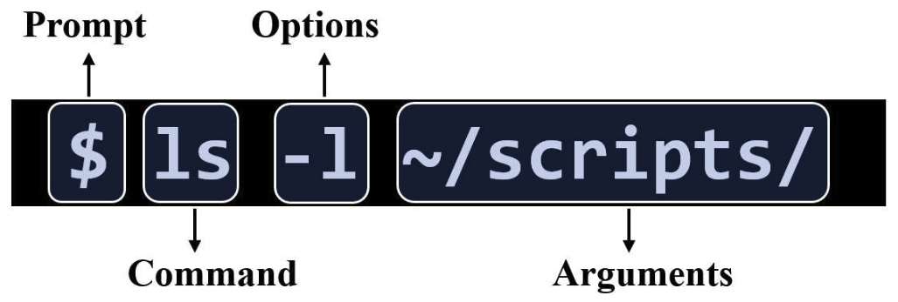

.. _unix-basics:

============
Unix Basics
============
| Contributors: Nathan TM Huneke, Harry Fagan, Yukai Zou
| Maintainers: Nathan TM Huneke
------------------------

What is Unix?
-------------
* Unix refers to a family of proprietary operating system. 
* Different from Windows which presents a *graphical user interface (GUI)*, Unix uses a *command line interface (CLI)* where you type commands you want to run into a terminal.
* Unix was designed to be used by many users at the same time.
* Command line interpreters are called shells (two commonly used ones are bash [Bourne-again shell] and zsh [Z-shell])
* Most neuroimaging packages need to be run from a command line

How to run Unix commands
~~~~~~~~~~~~~~~~~~~~~~~~

.. tabs::
    .. group-tab:: Windows
        To use Unix commands on Windows, you would need to install a Terminal emulator (e.g. `Git for Windows <https://gitforwindows.org/>`_), or to enable `Windows Subsystem for Linux (WSL) <https://docs.microsoft.com/en-us/windows/wsl/install>`_ feature.
    .. group-tab:: MacOS
        Your default shell is the Terminal program. To locate Terminal, click the Launchpad icon in the Dock, enter "Terminal" in the search field, and click on Terminal. A user guide for Terminal is available `here <https://support.apple.com/en-gb/guide/terminal/welcome/mac>`_.
    .. group-tab:: Linux
        You already have Terminal installed, so you can open a terminal directly and start typing commands.

Command Structure
*****************

A command typically consists of the following four components:

.. note::
    You can practice using Unix online with JupyterLab (see https://neuroimaging-core-docs.readthedocs.io/en/latest/pages/unix.html for an excellent tutorial).
    
    An excellent tutorial on the use of the Unix Shell is available `here <https://swcarpentry.github.io/shell-novice/>`_.

Basic Unix Commands
--------------------

- ``man`` Display the manual page of a given command
- ``pwd`` Print Working Directory, tells you the current directory you are in  
- ``cd <directory>``    Change Directory, takes to you the directory specified                                                                        
- ``cd ~``               Go to home directory                                                                                                           
- ``cd /``                 Go to root directory                                                                                                         
- ``cd ..``                 Go to the parent directory
- ``cd -``                 Go to the last directory
- ``ls``                    List, lists the contents of the directory you are in                                                                        
- ``ls <directory>`` Lists contents of the specified directory                                                                                           
- ``ls -a``                Lists all files and directories in the directory you are in (including hidden ones which start with an “.” and don’t appear is you just you the “ls” command)
- ``ls -F``                Annotate different types of files, directories (ended with "\") and links (ended with "@")
- ``ls -l``                 Long list, lists all files and directory with ownership and user permissions                                        
- ``ls -al``               Long list (including hidden files and directories)                                                                         
- ``ls -t``                Sort files by last-modified time
- ``ls -r``                Reverse the order of the sort
- ``ls -h``                Display file sizes in human readable format
- ``mkdir <name>``  Creates a directory with that name                                                                                                   
- ``mkdir .<name>`` Creates a hidden directory with that name                                                                                         
- ``history``            Lists all recently run commands                                                                                                
- ``!<number>``   Re-runs command specified (by number from history list)                                                                     
- ``cp -r <from> <to>`` Copies a directory from one path to another path                                                                           
- ``mv <from> <to>``  Move a file to a new location, or rename a file or directory to a different name
- ``rm <file>``      Deletes a file                                                                                                               
- ``rm -rf <directory>`` Deletes a directory
- ``ln``                 Create a link to an existing file or directory
- ``ln -s``                 Create a *symbolic* (or *soft*) link that can point to a path of a file or directory
- ``cat``                   Concatenate the contents of the given files, or simply to view the content of a single file
- ``diff <file1> <file2>``                 Compare two files and mark the lin numbers where they are different. Can also compare two different directories.

.. tip:: Tab completion

    Pressing the "Tab" key can auto-complete commands, files and directories or, when multiple entries are identified, suggest possible options. This would allow faster typing and is less likely to introduce typos.

Important Unix Directories
--------------------------

- ``/bin``               Where built-in Unix commands (e.g. ``ls``, ``mkdir``, etc...) are stored.                                              
- ``/etc``               Where system profiles are stored (e.g. users and passwords).                                                      
- ``/usr/local/bin`` Where user-installed programmes are often stored, unless user specifies a different install location
