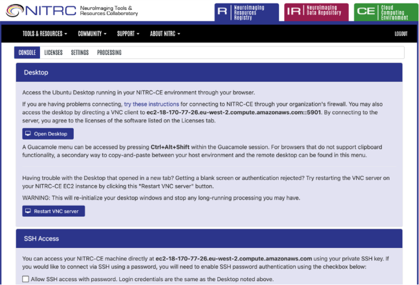

.. _cloud-computing:

==========================
Cloud Computing
==========================
| Contributors: Yukai Zou
| Maintainer: Yukai Zou

--------------

.. note::
	Under construction

Cloud Computing: Basics
-----------------------

Place holder for intro paragraph. Explain what it is, the benefits, things to consider, and the available options.

Working on local machine vs. on cloud
*************************************

+---------------------------------------+---------------------+------------------------+
|                                       | **Working locally** | **Working on cloud**   |
+---------------------------------------+---------------------+------------------------+
| **Who is the owner?**                 | You                 | Cloud service provider |
+---------------------------------------+---------------------+------------------------+
| **Who manages software environment?** | You                 | Cloud service provider |
+---------------------------------------+---------------------+------------------------+
| **Who installs software packages?**   | You                 | You                    |
+---------------------------------------+---------------------+------------------------+
| **Availability of apps and code**     | Yes                 | Transfer needed        |
+---------------------------------------+---------------------+------------------------+
| **Availability of data**              | Yes                 | Tranfer needed         |
+---------------------------------------+---------------------+------------------------+

Instance Types
**************

::

   mem2_ssd1_v2_x16

* ``mem2``: Memory Available per core, ranging from 3.8 GB to 1.9 TB. 
* ``ssd1``: Disk Space Available per core, ranging from 40 GB to 60 TB.
* ``v2``: Versioning. *Always use version 2 of an instance type*.
* ``x16``: Cores/GPUs available, ranging from 2 to 126 cores.

.. note::
    
    **What are the differences between ssd and hdd?**

.. note::
    
    **What are the key things to consider when choosing instance types?**
    
    - Whether your software requires more memory (``mem2`` vs. ``mem3``)
    - Whether your software requires large storage space (``ssd1`` vs. ``ssd2``)
    - Whether your software utilises multiple cores (``x16`` vs. ``x32``)
    - Whether your software is GPU optimised (``gpu_x32``)

UK Biobank Research Analysis Platform (RAP)
-------------------------------------------

.. important::
   You must first have access to a project in UK Biobank. This typically comes with an Application ID, so please reach out to your PI to confirm this.

UK Biobank partners with `DNAnexus <https://www.dnanexus.com/>`_ to provide their cloud computing service, also known as Research Analysis Platform (RAP).

Request Access
**************

1. Register at the UK Biobank Access Management System at https://ams.ukbiobank.ac.uk/ams/, which will take up to 10 working days for approval.

Costs and Billing
*****************

Detailed information about rates of different instance types is available `here <https://20779781.fs1.hubspotusercontent-na1.net/hubfs/20779781/Product%20Team%20Folder/Rate%20Cards/BiobankResearchAnalysisPlatform_Rate%20Card_Current.pdf>`_.

NeuroImaging Tools & Resourcees Collaboratory (NITRC)
-----------------------------------------------------

NeuroImaging Tools & Resourcees Collaboratory (NITRC, https://nitrc.org) is a free web-based resource that offers comprehensive information on neuroinformatics software and data. To date, more than 1,000 neuroimaging tools and resources have been registered, and NITRC has become the *de facto* standard mechanism for sharing neuroimaging tools and resources. NITRC contains three main components: Resource Registry (NITRC-RR), Imaging Repository (NITRC-IR), and Computational Environment (NITRC-CE).

NITRC-CE: the Computational Environment
***************************************

NITRC-CE provides a cloud-based, pay-as-you-go virtual computing platform. It is pre-configured with popular neuroimaging tools, including FSL, FreeSurfer, ANTs, C-PAC, MRIcron, etc. A full list of the installed packages is available `here <https://www.nitrc.org/plugins/mwiki/index.php/nitrc:User_Guide_-_NITRC_Computational_Environment_Installed_Packages>`__. Additionally, you can also add your own commercial or open source tools.

Setting up NITRC-CE on Amazon Web Services (AWS)
************************************************

.. note::
    
    You can `build your own NITRC-CE instance <https://www.nitrc.org/plugins/mwiki/index.php/nitrc:User_Guide_-_NITRC_Computational_Environment_Getting_Started#Building_Your_Own_NITRC-CE>`_.

Using NITRC-CE on AWS is a straightforward process and can save substantial time setting up a computational environment for neuroimaging data analysis.

1. Visit https://www.nitrc.org/;
2. Click on "CE: Cloud Computing Environment" on top right;
3. Click on "Access NITRC-CE", and select "Find a NITRC-CE AMI" in the drop-down menu;
4. Follow the instructions to set up EC2 instance.
5. (Optional) Under Advanced details, selecting "Request Spot Instances" can take advantage of spare/unused EC2 instances, which significantly reduces cost compared to On-Demand instances.
6. After the instance is launched and status checked, from your EC2 Console Dashboard, copy the Instance ID, visit the Public IPv4 address, and paste the Instance ID into the interface.
7. You will see this screen after login successfully:

AWS EC2 Pricing
***************

Pricing information for using AWS EC2 instances is available `here <https://aws.amazon.com/ec2/pricing>`_.