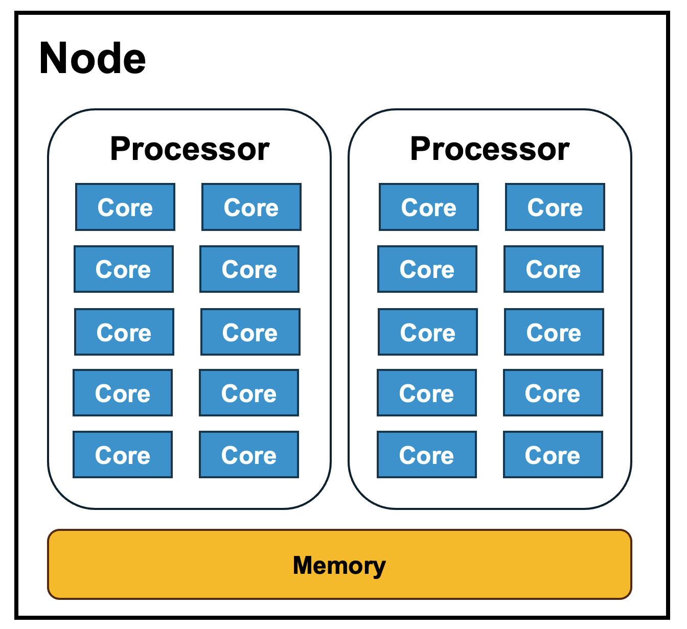
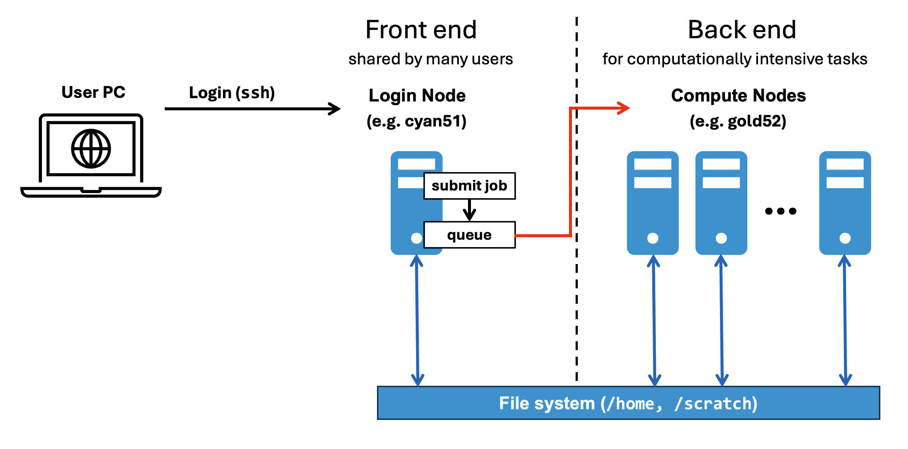

.. _hpc:

==========================
High Performance Computing
==========================
| Contributors: Yukai Zou
| Maintainer: Yukai Zou

--------------

.. note::
	Under construction

.. important::
   
   There is a learning curve ahead. It's important that you first get familiar with operating within a command line interface, and know how to write basic scriptings. More contents and resources of these topics will be added to this handbook.

High Performance Computing (HPC) accelerates large workflows of *highly-interdependent* sub-tasks, which can effectively make the processing and analysis of neuroimage data (especially large dataset) more efficient. The University of Southampton has one of the largest computational facilities in the UK. `The Iridis Compute Cluster <https://www.southampton.ac.uk/isolutions/staff/iridis.page>`_ is one of the world's top supercomputers, which is now in the 5th generation.

HPC Vocabulary
--------------

What is a Cluster?
~~~~~~~~~~~~~~~~~~

A cluster can be conceptualised as a *system* that consists of three main components:

1. **Hardware**. This includes compute nodes, interconnection networks, and storage.
2. **Software**. This includes the operating system, compilers, libraries, applications, and the queue manager that handles the scheduling and execution of tasks.
3. **Infrastructure**. This includes front-end interface, power supply, cooling, data center facility, and technical staff who manages and maintain all of them.

Clusters are designed to specifically tackle large-scale and computationally intensive problems, such as image processing and simulations. Clusters are widely used in applications such as hydraulic modeling, finance, climate prediction, urban traffic analysis, astronomy, proteomics, and many more.

Node vs. Core
~~~~~~~~~~~~~

A *node* is a *single* computing unit on a cluster. Normally, a node consists of processor(s), memory, storage, network connectivity, and can communicate with other nodes in the cluster to exchange data and coordinate their work.

A *core*, also known as logical processor, is an *individual* compute unit on a physical processor (or CPU, Central Processing Unit).

Below is an example of a node containing two physical processors, each with 10 cores, resulting in a total of 20 logical processors:

In HPC, the queue manager essentially "sees" logical processors rather than those physical chips (CPUs). Therefore, we will mostly focus on how to make the most of *cores* to help accelerate our workload.

Login vs. Compute Node
~~~~~~~~~~~~~~~~~~~~~~

- Login node is also known as the front-end node.
- Login node is shared by many users.
- Compute node is dedicated nodes that are configured to run a computationally intensive task.
- Your goal is to get your jobs running at the compute nodes.

Below is a diagram that illustrates differences between login node and compute node:

.. important::

	Overloading login nodes can cause issues for other users. Login nodes are intended for short interactive processing only. For longer, interactive work, please utilise ``sinteractive`` sessions. 

Request Access
--------------

.. tabs::
    .. group-tab:: For Staff/PGR Students
        Once you have obtained UoS username and password, you will be able to apply for Iridis access after a completing an `Iridis Account Application form <https://sotonproduction.service-now.com/serviceportal?id=sc_cat_item&sys_id=bce3a6fa1bf34210e3076351f54bcbe9>`_. The form will ask for a brief justification of usage. If you are uncertain how to fill out the form, please contact your research advisor or line manager.
    .. group-tab:: For Undergraduate/MSc Students
        You can access the Lyceum service and your Project Supervisor/Course Tutor will fill out an `Lyceum Account Application form <https://sotonproduction.service-now.com/serviceportal?id=sc_cat_item&sys_id=2ba3bad5db8f2b00f91c8c994b961961>`_ on your behalf.

Once your access has been granted, you are also subscribed to the HPC mailing list. Make sure to keep an eye on any notice regarding power outage and scheduled maintenance, to ensure your workflow can complete successfully.

Here are a few links to the resources:

- HPC Community Wiki: https://sotonac.sharepoint.com/teams/HPCCommunityWiki
- Submit a job: https://sotonac.sharepoint.com/teams/HPCCommunityWiki/SitePages/Submitting-Jobs-Slurm.aspx
    - Specify job resources: https://sotonac.sharepoint.com/teams/HPCCommunityWiki/SitePages/Submitting-Jobs-Slurm.aspx#specifying-job-resources
- Job extension policy: https://sotonac.sharepoint.com/teams/HPCCommunityWiki/SitePages/Fair-usage-and-Job-extension-policy.aspx

Connect to Iridis
-----------------

To access Iridis, you would need to set up an SSH connection. The methods depend on the operating system you are using.

.. note::

    If you are off site when planning to use Iridis, you will need to connect to  
    the University's `VPN <https://knowledgenow.soton.ac.uk/Articles/KB0011610>`_ first.

.. tabs::
    .. group-tab:: Windows
        You may use clients available for Windows, such as `MobaXterm <https://mobaxterm.mobatek.net/>`_, `PuTTY <https://www.putty.org/>`, or `ThinLinc <https://www.cendio.com/thinlinc>`_. Alternatively, you may run SSH in `Windows Subsystem for Linux <https://learn.microsoft.com/en-us/windows/wsl>`.
    .. group-tab:: MacOS/Linux
        You can run SSH in `Terminal <https://support.apple.com/en-gb/guide/terminal/welcome>`_ or a Terminal emulator such as `iTerm2 <https://iterm2.com/>`_. Instructions for MacOS goes here.

Launching an interactive session
================================

Initiating an interactive session on a compute node using the ``sinteractive`` command allows for interactive computing and the use of the GUI over X11, e.g. for RStudio, without the risk of overloading the login nodes.

Check out the following page for more details on how to use ``sinteractive``: https://sotonac.sharepoint.com/teams/HPCCommunityWiki/SitePages/Submitting-Jobs-Slurm.aspx#interactive-jobs

Using job arrays
==================

To run jobs in parallel can greatly accelerate your workflow and save time.

- https://sotonac.sharepoint.com/teams/HPCCommunityWiki/SitePages/Submitting-Jobs-Slurm.aspx#job-arrays

Visualisation on Iridis 5
=========================

Although mainly operated in a command line interface, Iridis 5 provides options for visualisation through graphical interface. This section concerns with the option of using `NICE Desktop Cloud Virtualisation <https://nice.soton.ac.uk>`_.

 - Setting up EngineFrame VNC: https://sotonac.sharepoint.com/teams/HPCCommunityWiki/SitePages/Data-Visualisation.aspx#engineframe-vnc

Visualization Expansion Portal (Linux Orange)
~~~~~~~~~~~~~~~~~~~~~~~~~~~~~~~~~~~~~~~~~~~~~

In addition to Linux Desktop, Iridis 5 visualisation expansion portal Linux Orange has become available since October 2023. 

+----------------+-------------------------------+
| Nodes          | ``orange02`` and ``orange03`` |
+----------------+-------------------------------+
| Sessions       | 4                             |
+----------------+-------------------------------+
| CPU cores      | 12                            |
+----------------+-------------------------------+
| Memory         | 240 GB                        |
+----------------+-------------------------------+
| GPU available? | No                            |
+----------------+-------------------------------+

(Optional) Mount Research Filestore to Iridis
======================================

The University Research Filestore is a secure research data storage service provided by iSolutions, for the research community to store active research data. Data on the research filestore is backed up and with an extra copy stored in a secure location (for disaster recovery purposes). The newest research filestore supports mounting onto Iridis 5, and this allows a more direct access to the research data via a shared filesystems and network.

.. note::
	Due to the age and the nature of the setup, some research filestore cannot be mounted onto Iridis 5. This is mainly for security reasons. Older research filestore can't set up an NFS export that allows the directory to be mounted in a way that protects the sensitive nature of the data when retrieved via other users on Iridis 5. 
	
	**Solution:** If the data owner requests a new research filestore space, then it can be set up with the old data copied into it. To do this, make a request by filling out a form `here <https://sotonproduction.service-now.com/serviceportal?id=sc_cat_item&sys_id=903e688edbbbf300f91c8c994b961974>`_. iSolution should be able to mount the new filestore to Iridis 5 allow direct access of data.

A100 Scavenger Nodes
--------------------

An A100 scavenger queue has been added to Iridis 5 in December 2023. This queue contains one node and has a twelve hour time limit, and is available to all Iridis 5 users. This may be of interest to users who are interested in testing the A100 GPUs before their full release to the user community.

Specification
=============

+----------------+-----------------------------------------------------------------------+
| GPU hardware   | Dual A100 NVLinked GPUs (160GB VRAM total across two GPUs)            |
+----------------+-----------------------------------------------------------------------+
| CPU hardware   | 48 intel CPUs (24 cores x 2 sockets, Intel(R) Xeon(R) Gold 6336Y CPU  |
|                | @ 2.40GHz)                                                            |
+----------------+-----------------------------------------------------------------------+
| Memory         | 480GB of RAM                                                          |
+----------------+-----------------------------------------------------------------------+

How to access the node
======================

Please use the partition ``a100_scavenger`` to access the node.
