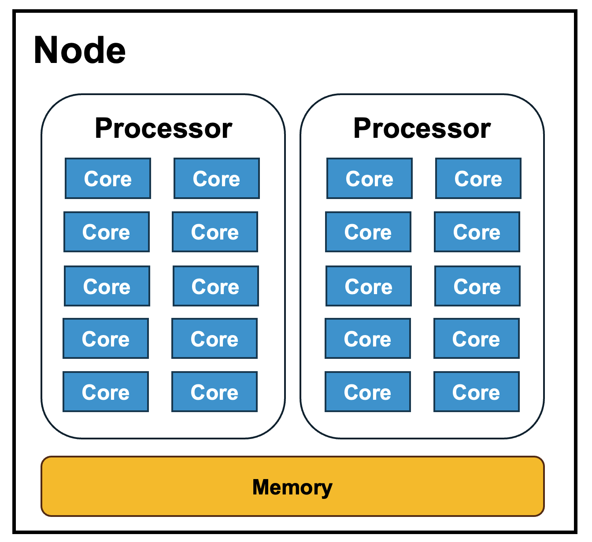
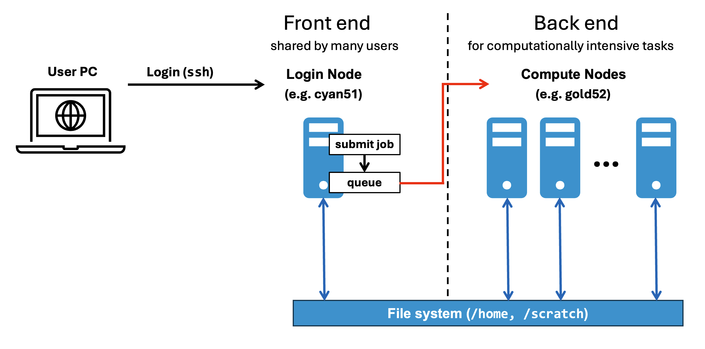
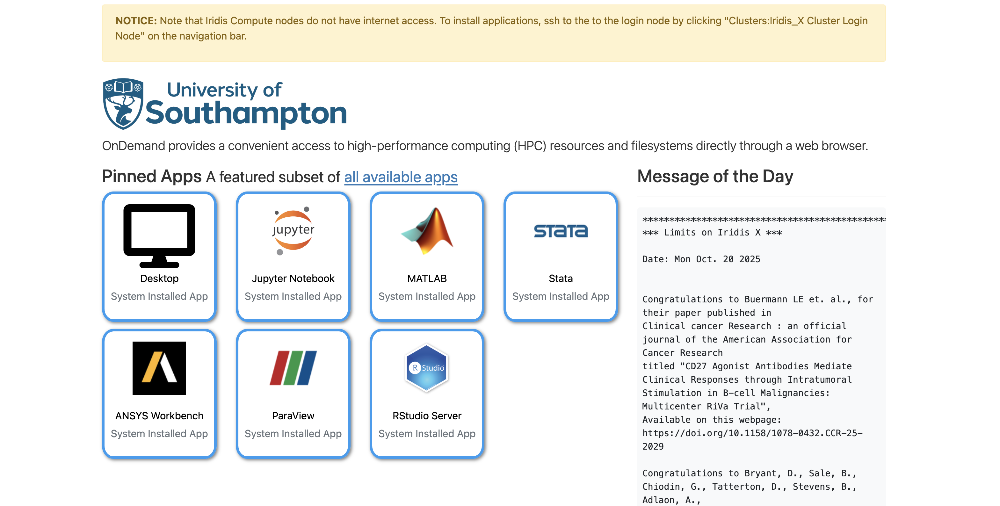
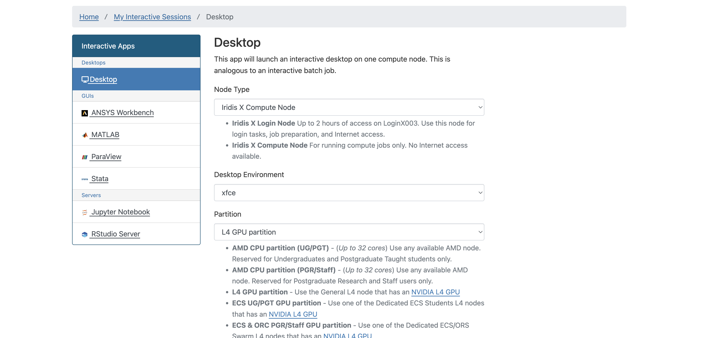
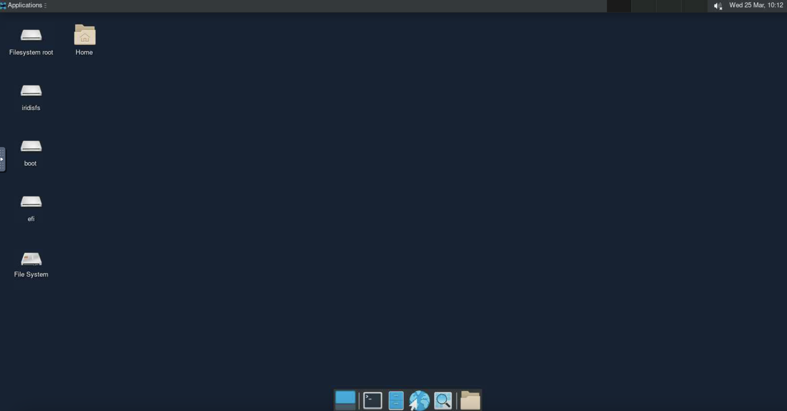

.. _hpc:

==========================
High Performance Computing
==========================
| Contributors: Yukai Zou, Nathan Huneke
| Maintainer: Yukai Zou

--------------

.. note::
	Under construction

.. important::
   
   There is a learning curve ahead. It's important that you first get familiar with operating within a command line interface, and know how to write basic scriptings. More contents and resources of these topics will be added to this handbook.

High Performance Computing (HPC) accelerates large workflows of *highly-interdependent* sub-tasks, which can effectively make the processing and analysis of neuroimage data (especially large dataset) more efficient. The University of Southampton has one of the largest computational facilities in the UK. `The Iridis Compute Cluster <https://www.southampton.ac.uk/isolutions/staff/iridis.page>`_ is one of the world's top supercomputers, which is now in the 5th generation.

HPC Vocabulary
--------------

What is a Cluster?
~~~~~~~~~~~~~~~~~~

A cluster can be conceptualised as a *system* that consists of three main components:

1. **Hardware**. This includes nodes, interconnection, and storage.
2. **Software**. This includes the operating system, compilers, libraries, applications, and the queue manager that handles the scheduling and execution of tasks.
3. **Infrastructure**. This includes front-end interface, power supply, cooling, data center facility, and technical staff who manages and maintain all of them.

Clusters are designed to specifically tackle large-scale and computationally intensive problems, such as image processing and simulations. Clusters are widely used in applications such as hydraulic modeling, finance, climate prediction, urban traffic analysis, astronomy, proteomics, and many more.

Node vs. Core
~~~~~~~~~~~~~

A *node* is a *single* computing unit on a cluster. Normally, a node consists of processor(s), memory, storage, and network connectivity that allows exchange of data and coordinate tasks with other nodes in the cluster.

A *core*, also known as logical processor, is an *individual* compute unit on a physical processor (or CPU, Central Processing Unit).

Below is an example of a node containing two physical processors, each with 10 cores, resulting in a total of 20 logical processors:

In HPC, the queue manager essentially "sees" logical processors rather than those physical chips (CPUs). Therefore, we will mostly focus on how to make the most of *cores* to help accelerate our workload.

Login vs. Compute Node
~~~~~~~~~~~~~~~~~~~~~~

- Login node is also known as the front-end node.
- Login node is shared by many users.
- Compute node is dedicated nodes that are configured to run a computationally intensive task.
- Your goal is to get your jobs running at the compute nodes.

Below is a diagram that illustrates differences between login node and compute node:

.. important::

	Overloading login nodes can cause issues for other users. Login nodes are intended for short interactive processing only. For longer, interactive work, please utilise ``sinteractive`` sessions. 

Iridis Open OnDemand
----------------------

For imaging projects, we suggest connecting via Iridis Open OnDemand. This allows you to use interactive apps via a graphical interface, which is almost essential when using FSL or CONN.

Requesting Access
~~~~~~~~~~~~~~~~~~~

You can request access to Iridis Open OnDemand at the `Sharepoint site <https://sotonac.sharepoint.com/teams/HPCCommunityWiki/SitePages/Iridis_Open_OnDemand.aspx>`_

Connecting to Iridis Open OnDemand
~~~~~~~~~~~~~~~~~~~~~~~~~~~~~~~~~~~

.. important::
    
    You must be connected to the University VPN to use Iridis Open OnDemand

Click on `Connect` on the `Sharepoint site <https://sotonac.sharepoint.com/teams/HPCCommunityWiki/SitePages/Iridis_Open_OnDemand.aspx>`_.

You will see the following screen:

We suggest opening the `desktop` app. Clicking on this will give you several login options:

- Node type
  
  .. rubric:: Options

        **Login Node**
            Gives up to 2 hours access. *Use this node for Internet access.* When choosing this node the other options below will not apply.

        **Compute Node**
            *No internet access!* Use this node for running compute jobs only.

- Desktop environment: your only option here is xfce
- Partition

    .. rubric:: Options

        **AMD CPU partition**
            Up to 32 cores for compute jobs

        **L4 GPU partition**
            Required if you plan on using applications with a GUI (e.g. FSL)
        
        **Others**
            Dedicated for ECS

- If choosing the AMD CPU partition, you will be asked how many cores you would like: must be <=32 (3.5GB RAM per core)
- Walltime (hours): must be <= 60 hours
- Name: leave blank

Once you launch your session, a screen summarising it will appear, with a button saying `Launch Desktop`. Click on this and you will see the xfce environment below:

When you are done, click on your `username` in the top right corner and `logout`. You can then close the window. 