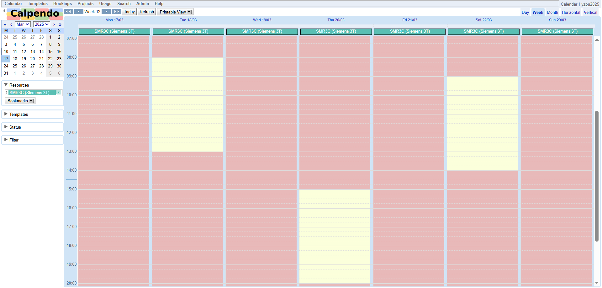
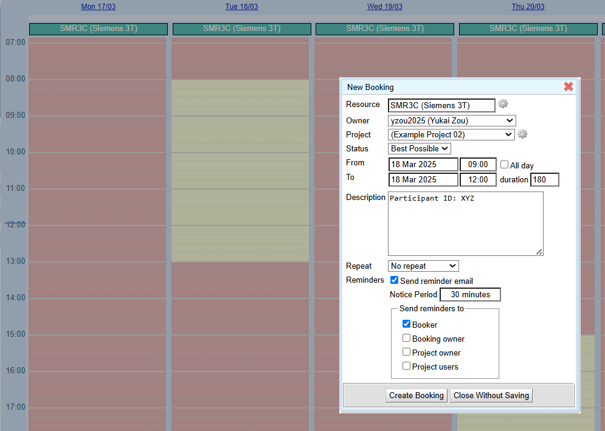

.. _mri-scanner:

=====================
Research MRI Scanners
=====================
| Contributors: Yukai Zou
| Maintainers: Yukai Zou

--------------

.. important::

    We have now transitioned to `**Calpendo** <https://uhs-rad.calpendo.com/>`_, a new booking system for managing research MRI slots. Calpendo offers enhanced features for scheduling and resource management, and we are confident it will provide a more efficient and long-term solution for our research MRI bookings. 

Making Reservation
------------------

`Calpendo <https://uhs-rad.calpendo.com/>`_ is now the online booking system for our research MRI scanners at UHS. It allows both UoS researchers and UHS staff (radiographers and research nurses) to view scanner availability and make, update, and cancel reservations.

Link: https://uhs-rad.calpendo.com/

How do I register?
==================

To register for Calpendo, please visit `https://uhs-rad.calpendo.com/ <https://uhs-rad.calpendo.com/>`_ and click on "Register new user" to request an account. You will need to provide your name, email address, login username, and a password. Once you have submitted your request, you will get notified once your request is approved, typically within a week.

How does this work?
===================

Here is how the calendar looks like:

**For Radiographer**: As the resource administrator of SMR3C, you will receive email notifications whenever a new reservation is proposed. You can then approve or reject the reservation based on staff availability during the requested time. Once approved, the study coordinator will confirm the appointment with the participant.

**For Research Coordinators/Nurses**: You will have access to view the availability for SMR3C. You can propose new reservations, which will remain pending until approved by a radiographer. Once approved, you will receive an email notification, and you can then confirm the appointment with the participant.

.. note::
    
    **What is SMR3C exactly?** 
    
    SMR3C is a 3T Siemens Vida MRI scanner located on Level C in the `MRI Outpatients Department at UHS<https://www.uhs.nhs.uk/whats-new/press-releases/university-hospital-southampton-opens-12.2m-state-of-the-art-mri-outpatients-department>`_. SMR3C supports various research studies and is a critical research imaging infrastructure at Southampton.

How do I make a reservation?
=============================

To make a reservation, click on "Calendar" in the navigation bar (you will typically be viewing the Calendar after logging in). Then, click on or drag on the booking calendr to select the desired time slot. Note that different colors on the calendar indicate whether the scanner is available for booking or unavailable due to maintenance or clinical work. A pop-up window will appear like the following:

In the pop-up window, you will need to provide key information about your reservation. It is recommended to include the **participant IDs (instead of their names)** and specify your Project name. Click on "Create Booking" to submit your reservation request. 

The Admin team will review your request, and you will receive an email notification once it is approved. By default, you will get a reminder email before the appointment. Please ensure you coordinate with the participant to facilitate a smooth scanning session.
