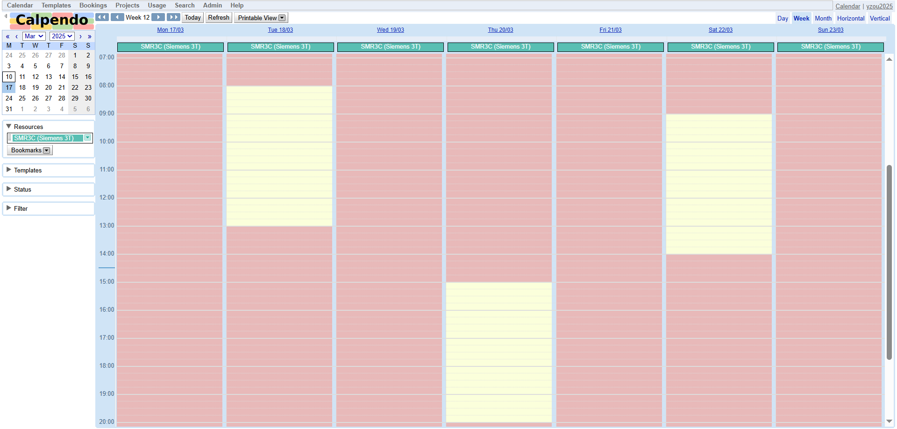
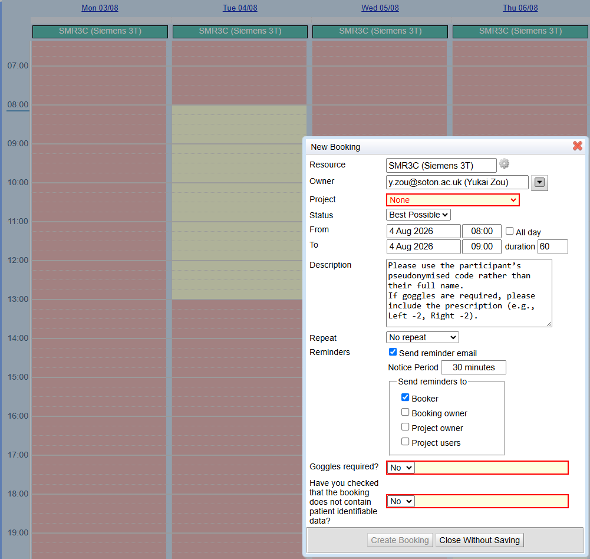
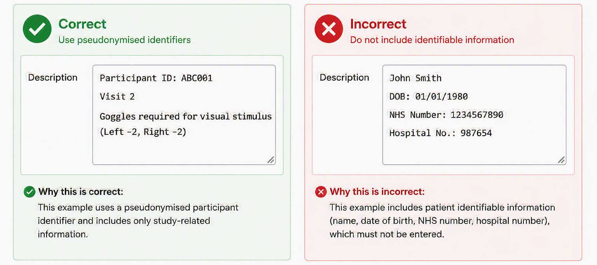

.. _mri-scanner:

=====================
Research MRI Scanners
=====================
| Contributors: Yukai Zou
| Maintainers: Yukai Zou

--------------

.. important::

    We have now transitioned to `Calpendo <https://uhs-rad.calpendo.com/>`_, a new booking system for managing research MRI slots. Calpendo offers enhanced features for scheduling and resource management, and we are confident it will provide a more efficient and long-term solution for our research MRI bookings. 

Making Reservation
------------------

`Calpendo <https://uhs-rad.calpendo.com/>`_ is now the online booking system for our research MRI scanners at UHS. It allows both UoS researchers and UHS staff (radiographers and research nurses) to view scanner availability and make, update, and cancel reservations.

Link: https://uhs-rad.calpendo.com/

How do I register?
==================

To register for Calpendo, please visit `https://uhs-rad.calpendo.com/ <https://uhs-rad.calpendo.com/>`_ and click on "Register new user" to request an account. You will need to provide your name, email address, login username, and a password. Once you have submitted your request, you will get notified once your request is approved, typically within a week.

How does this work?
===================

Here is how the calendar looks like:

**For Radiographer**: As the resource administrator of SMR3C, you will receive email notifications whenever a new reservation is proposed. You can then approve or reject the reservation based on staff availability during the requested time. Once approved, the study coordinator will confirm the appointment with the participant.

**For Research Coordinators/Nurses**: You will have access to view the availability for SMR3C. You can propose new reservations, which will remain pending until approved by a radiographer. Once approved, you will receive an email notification, and you can then confirm the appointment with the participant.

.. note::
    
    **What is SMR3C exactly?** 
    
    SMR3C is a 3T Siemens Vida MRI scanner located on Level C in the `MRI Outpatients Department at UHS <https://www.uhs.nhs.uk/whats-new/press-releases/university-hospital-southampton-opens-12.2m-state-of-the-art-mri-outpatients-department>`_. SMR3C supports various research studies and is a critical research imaging infrastructure at Southampton.

Plan Ahead
==========

.. important::

    Bookings must be made at least **3 working days in advance**.

Please plan your scans well ahead of time to avoid missing your preferred time slots. Each slot becomes unavailable a few days in advance:

- **Tuesday 8am slot**: unavailable from the previous Thursday at 8am
- **Thursday 3pm slot**: unavailable from the previous Monday at 3pm
- **Saturday 9am slot**: unavailable from the previous Wednesday at 9am

How do I make a reservation?
=============================

To make a reservation, click **Calendar** in the navigation bar (this is usually the default view after logging in). Then you can either click on or drag across the booking calendar to select the desired time slot.

Different colours on the calendar indicate whether the scanner is available for booking or unavailable due to other reasons.

A pop-up window similar to the one below will appear:

where you will need to provide key information about your reservation.

Booking Information Requirements
~~~~~~~~~~~~~~~~~~~~~~~~~~~~~~~~~

1. **Project:** The relevant project must be selected when creating a booking request.
2. **Goggles Requirement** 

- If the participant requires wearing goggles, please indicate this in the booking request, so that a pair of MR-compatible goggles will be prepared. **This is important for fMRI studies involving visual stimulus presentation.**
- If goggles are required, please include the participant's prescription (e.g. Left -2, Right -2) in the description field.

3. **Patient Identifiable Information (PII)**

- *Do not enter any patient identifiable information in the Description field.* 
- Use pseudonymised participant identifiers instead of names, dates of birth, NHS numbers, hospital numbers, or any other identifying details.
- Before a booking request can be submitted, you must confirm that no identifiable information has been entered by selecting **Yes** in the confirmation box.
- **Booking requests containing patient identifiable information will be cancelled and a new request will need to be submitted.**

Example
~~~~~~~

Here is an example for correct and incorrect information entered in the Description field:

What Happens Next
~~~~~~~~~~~~~~~~~

After submission, the MRI Research Admin Team will review your request.

If further information about the participant is required, you may be contacted by the Admin Team. Any personal information or identifiable data must be sent using a secure email method, in compliance with UHS information governance.

You will receive an email notification once the booking request has been approved.

By default, reminder emails are sent before the appointment. Please ensure that all participant arrangements have been confirmed in advance to facilitate a smooth scanning session.
