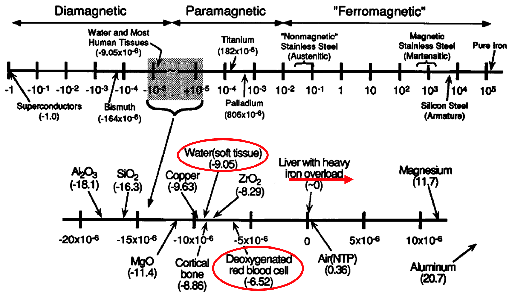
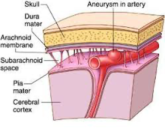
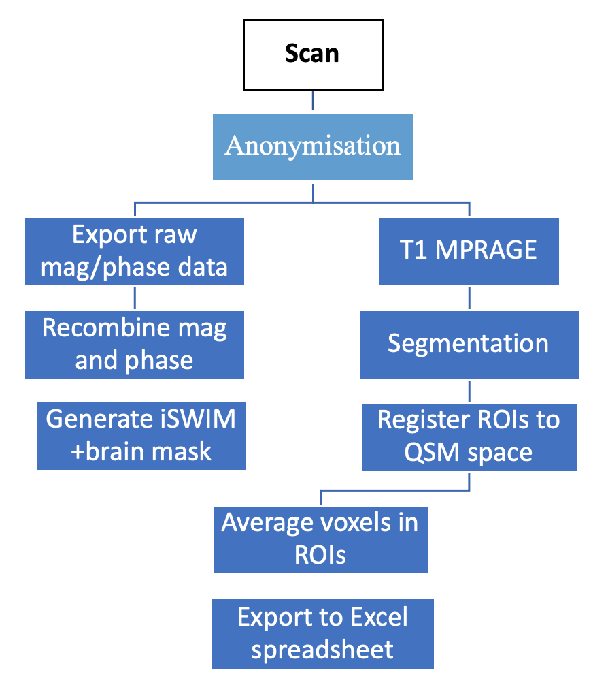
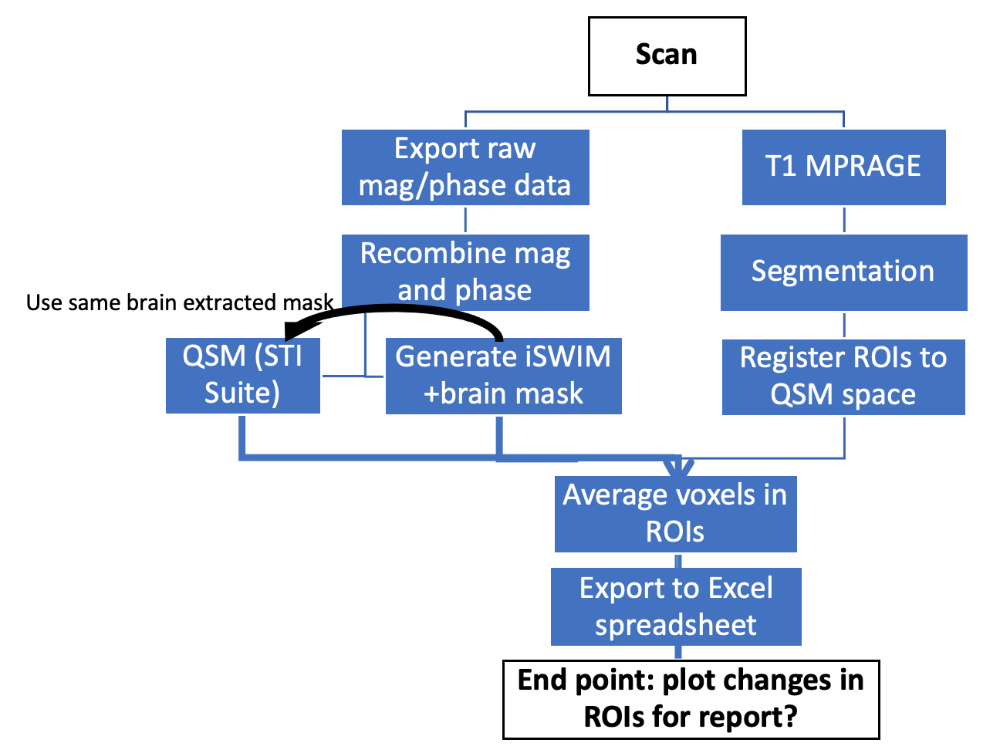

==============================================
QSM Analysis
==============================================
| Contributors: Mobeen Ali, Yukai Zou
| Maintainers: Yukai Zou

------------------------------------------

.. note:: 

    Under construction

Background and Theory
---------------------

Susceptibility weighted imaging (SWI) is sensitive to both iron and myelin, and therefore SWI is used clinically to provide additional contrast to T1 and T2 weighted images.

Role of iron in the brain
*************************

Iron is involved in regulating electrons in metabolic processes, such as the Krebs cycle and oxidative phosphorylation. In addition, iron is also involved in oxygen transport in the brain via haemoglobin.

Role of myelin in the brain
***************************

Myelin forms a sheath around axons of neurons, which insulates the axons and increases the speed of electrical signal transmission.

Motivations for QSM
*******************

Iron accumulates in the brain with age and link to neurodegenerative diseases, such as Alzheimer's disease, Parkinson's disease, and multiple sclerosis. 

Magnetic Susceptibility
***********************

Clinical Applications
---------------------

Calcification
*************

Hypoxic Ischemic Encephalopathy
*******************************

Subarachnoid haemorrhage
************************

- Subarachnoid haemorrhage refers to the bleeding in the subarachnoid space, usually from a ruptured aneurysm.

Workflow:

- Iron deposited in the brain after subarachnoid haemorrhage around the Sylvian fissures.
- Need to investigate the relationship of iron and brain volume changes.
- Future work includes studying whether clinical outcome is more closely associated with baseline blood volume or iron deposition.

Superficial Siderosis
*********************

- Hemosiderin deposited on the pial surface of the brain and/or spinal cord, as a result of chronic subarachnoid haemorrhage.
- Deferiprone is an iron chelator that can be used to treat superficial siderosis.
- There is a need to develop a workflow for rare clinical cases, such as superficial siderosis.

Workflow:

